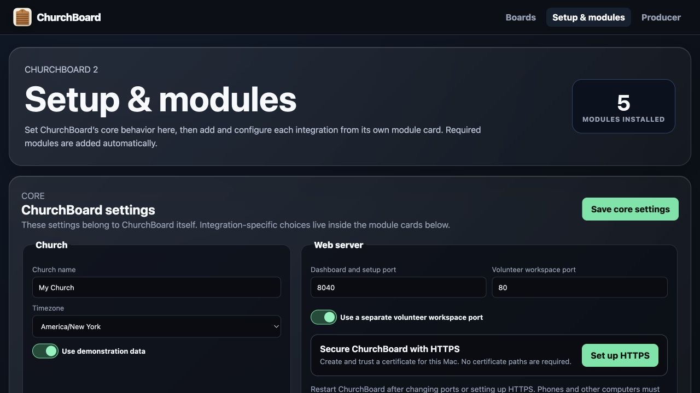
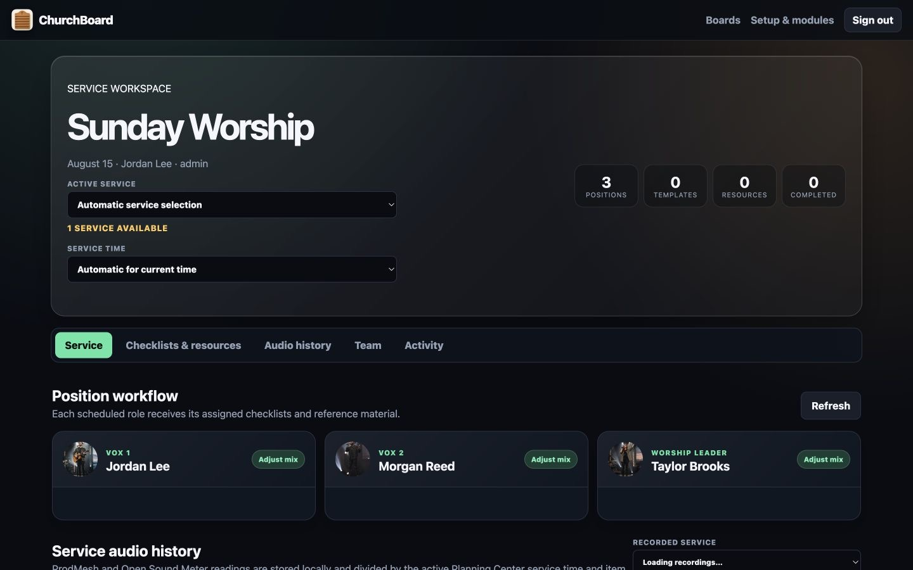
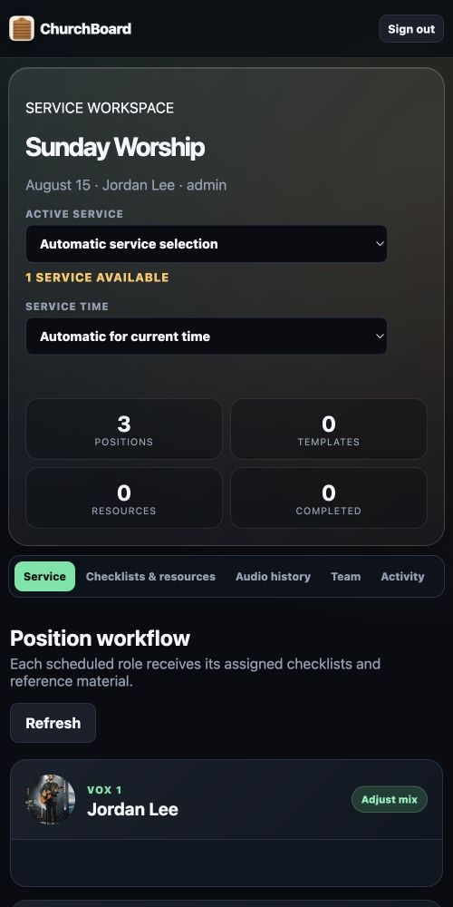
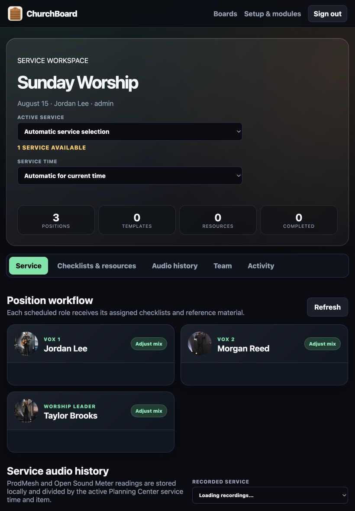

<p align="center">
  
</p>


<h1 align="center">ChurchBoard</h1>

ChurchBoard is a cross-platform production dashboard for churches. It combines Planning Center schedules and people, ProPresenter slides and service flow, Shure QLX-D/ULX-D/SLX-D and Sennheiser EW-DX microphone telemetry, Open Sound Meter and ProdMesh RTA levels, ShowXpress/TLC lighting controls, OBS Studio health, and Restream broadcast status in configurable displays for the stage, green room, audio booth, and production team.

ChurchBoard 1.4 adds a mobile-friendly Producer workspace with organization accounts and roles, campuses, Planning Center position checklists and tagged-media resources, completion tracking, portable dashboard layouts, configurable HTTP/HTTPS, and a redesigned widget editor. See the [Producer workspace guide](docs/PRODUCER.md).

The private **ChurchBoard 2 beta branch** adds a Companion-style module manager, dependency-aware integration installation, module-owned page/widget hooks, automatic per-service-time rosters, a restricted volunteer-only listener, offline-mirrored Planning Center resources, optional NDI® video, ProdMesh Remote RTA, ShowXpress/TLC lighting control, and a ChurchBoard-hosted LiveKit Producer party-line intercom. See [ChurchBoard 2 modules](docs/MODULES.md). These features remain private while they are field-tested; the installer links below continue to point to the stable release.

## Watch the setup and demo video

See ChurchBoard in action and follow the setup walkthrough in the **[ChurchBoard setup and demo video](https://youtu.be/pE_uWD24G2c)**.

[](https://youtu.be/pE_uWD24G2c)


## What ChurchBoard shows

- Photo-forward scheduled-position and microphone cards, including unassigned positions and a per-widget choice between one card per person or one card per position
- Shure QLX-D/ULX-D/SLX-D and Sennheiser EW-DX battery, RF/audio, transmitter, mute, warning, and online/offline status
- Current and next ProPresenter slides as text or slide images, with live countdown overlays and video playback progress
- A scrollable ProPresenter playlist that shows every playlist item, presentation, and section marker with a per-widget choice of rendered preview images or slide text; repeated arrangement sections retain correct thumbnails, and trusted operators can trigger a presentation or individual slide from ChurchBoard
- Optional live-board slide controls and keyboard control for ProPresenter, with corrected current-slide thumbnails and Planning Center-linked item matching
- A read-only ProPresenter timers widget showing each timer's current value and state
- ProPresenter item title, part labels and colors, slide number, and notes
- Compact, complete scrollable, or fit-to-board Planning Center orders of service—including pre-service and post-service sections—with durations, estimated clock times, leaders, and mapped microphones
- Current item and overall service timing
- Team-member lists with photos, filtered by team and position
- Direct Open Sound Meter monitoring with selectable weighting/response and downloadable service graphs and per-item averages
- ProdMesh Remote RTA monitoring with SPL, program loudness, signal state, and a responsive 31-band analyzer
- ShowXpress/TheLightingController cue-button pages contributed by WorshipWarehouse
- Restream broadcast, viewer, and destination-status monitoring through OAuth
- OBS Studio streaming/recording state, connection health, output statistics, dropped-frame warnings, and an optional preview image
- Planning Center Services LIVE control buttons
- A WYSIWYG dashboard editor with an always-visible **Edit** button, right-click settings, independent layouts, and color-matched liquid-glass widgets for each destination
- Exportable/importable dashboard layout files and a categorized widget palette with modal settings and direct edge/corner resizing
- A multi-provider livestream status widget with green/gray state lights, per-stream elapsed time, available live-viewer counts, Facebook/YouTube channel URLs, and independent BoxCast, Resi, and Restream API configuration
- A scrollable, resizable sermon-notes widget that selects a named note field from a Planning Center service item
- A dedicated ProPresenter control pad for previous/next slide and previous/next playlist item
- A mobile-friendly Producer workspace for position checklists, Planning Center tagged media, embedded resources, files, links, team access, campuses, and an activity trail
- Automatic or manual Planning Center service-time selection, including a different scheduled person in the same position at different services
- Optional NDI® source discovery and video widgets that dynamically load the licensed NDI runtime without requiring NDI Tools
- A restricted second listener for volunteer checklists and Producer tools, with Planning Center tagged media mirrored locally instead of reopening Planning Center
- Optional, locally hosted LiveKit party-line intercom with no cloud account or server credentials, plus AirPods/headset support, push-to-talk, latch-open microphones, multiple channels, and administrator mute-all
- A friendly module manager that installs required integrations automatically, keeps each module's setup guide and update policy together, and lets module-owned pages and widgets extend ChurchBoard without adding a new base widget type


## Download ChurchBoard

Choose your computer and click its download link:

| Your computer | Download |
| --- | --- |
| **Windows 10 or 11** | **[Download the Windows installer (.exe)](https://github.com/wtapper89/ChurchBoard/releases/latest/download/ChurchBoard-1.4.0-Windows-x64-Setup.exe)** |
| **Mac with Apple silicon** — M1 or newer | **[Download the Apple silicon Mac disk image (.dmg)](https://github.com/wtapper89/ChurchBoard/releases/latest/download/ChurchBoard-1.4.0-macOS-arm64.dmg)** |
| **Mac with an Intel processor** | **[Download the Intel Mac disk image (.dmg)](https://github.com/wtapper89/ChurchBoard/releases/latest/download/ChurchBoard-1.4.0-macOS-x86_64.dmg)** |
| **Ubuntu or Debian Linux** | **[Download the Linux installer (.deb)](https://github.com/wtapper89/ChurchBoard/releases/latest/download/ChurchBoard-1.4.0-Linux-amd64.deb)** |
| **Other 64-bit desktop Linux** | **[Download the portable Linux package (.tar.gz)](https://github.com/wtapper89/ChurchBoard/releases/latest/download/ChurchBoard-1.4.0-Linux-x86_64.tar.gz)** |

Not sure which Mac you have? Choose **Apple menu → About This Mac**. If it says **Chip**, use Apple silicon. If it says **Processor**, use Intel.

**Raspberry Pi:** jump to the [one-command Raspberry Pi installer](#raspberry-pi).

[View all v1.4.0 downloads and release notes](https://github.com/wtapper89/ChurchBoard/releases/tag/v1.4.0)

### What's new in 1.4.0

- Producer accounts with Admin, Editor, and Volunteer roles; optional passwords; editable campuses and users; local administrator recovery; and easier Planning Center person matching.
- Position-based, versioned checklists and resources, including Planning Center tagged media that opens inside ChurchBoard.
- Portable dashboard export/import, a categorized widget palette, modal settings, always-visible editor buttons, and direct drag resizing.
- Configurable listening port and direct HTTPS certificate support with mobile-friendly dashboards, editing, and Producer workflows.
- New livestream, OBS, ProPresenter control, timers, and sermon-notes widgets with responsive sizing.
- The ProPresenter Playlist can show rendered previews or slide text, follows repeated arrangements correctly, and keeps controls and auto-scroll configurable per board.

## Install

Every desktop installer configures ChurchBoard to start automatically. Opening ChurchBoard from the Start menu, Applications folder, or desktop menu opens its desktop control page in the default browser.

On macOS, the ChurchBoard icon stays in the menu bar. On Windows, it stays in the system tray. Its menu opens the desktop control page, Setup, or any configured board and can quit ChurchBoard. The desktop control page also checks GitHub for updates and opens the correct installer for the computer.

### Raspberry Pi

For Raspberry Pi OS:

```bash
curl -fsSL https://raw.githubusercontent.com/wtapper89/ChurchBoard/main/installers/raspberry-pi/install.sh | bash
```

Add `--kiosk` to open the Main dashboard fullscreen after desktop login:

```bash
curl -fsSL https://raw.githubusercontent.com/wtapper89/ChurchBoard/main/installers/raspberry-pi/install.sh | bash -s -- --kiosk
```

See [Installation](docs/INSTALLATION.md) for detailed steps, updates, automatic-start behavior, and uninstall instructions.

## First-time setup

Open `http://127.0.0.1:8040/modules`, turn off demonstration data in the core settings, then open the Planning Center module to configure it. ChurchBoard stores settings only on the computer running it.



Start with [Configuration](docs/CONFIGURATION.md), then follow the detailed [Planning Center setup](docs/PLANNING_CENTER.md), [ProPresenter setup](docs/PROPRESENTER.md), [Open Sound Meter setup](docs/OPEN_SOUND_METER.md), [ProdMesh Remote RTA setup](docs/PRODMESH_RTA.md), and [Restream setup](docs/RESTREAM.md) guides. They cover secure credentials, permissions, photos, leaders, linked service playlists, the Network API, Services LIVE automation, dashboards, microphone mapping, level reporting, livestream monitoring, and troubleshooting.

## Dashboard editing

Each dashboard has a stable URL. Add widgets from the palette, drag them on the canvas, and resize from the blue right edge, bottom edge, or corner. The upper-right **Edit** button or a right-click opens modal settings, leaving the full editor width for the board. Every widget title can be hidden. Scheduled-position widgets can consolidate multiple roles into one card per person or retain one card per position. The ProPresenter playlist widget shows the focused playlist as a continuous, automatically scrolling list; choose rendered preview images or slide text, compact/comfortable/large density, an active-slide border color, and whether slide controls and keyboard control start enabled on that board. A separate control widget provides previous/next slide and item buttons. Order-of-service widgets can show a compact current window, a scrollable complete plan, or the complete plan fitted to the widget. Text, cards, photos, timers, and status displays scale with their widget and stack into readable cards on narrow mobile screens. Setup can cancel a new dashboard before it is named, and the editor includes a confirmation-protected **Delete display** action. The display hamburger includes an **Edit** action beside every board, and **Open display** in the editor reuses the current tab.


## Producer workspace

Open `/producer` to manage the selected service and service time, position checklists, locally mirrored Planning Center resources, users, campuses, and activity. The separate volunteer listener defaults to port 80 and intentionally excludes dashboards and Setup; choose another unprivileged port such as 8080 when the operating system will not allow port 80. Existing installations remain usable without sign-in until the first owner account is created. See the [Producer workspace guide](docs/PRODUCER.md) for roles, optional passwords, Planning Center matching, mobile use, and backup guidance, and [NDI video and Producer intercom](docs/NDI_AND_INTERCOM.md) for the beta media and communications setup.



The Producer workflow is responsive for phones and tablets, keeping service selection, status, scheduled positions, checklists, and resources touch-friendly on the production network.

| Phone workflow | Tablet workflow |
| --- | --- |
|  |  |

## Credits, licenses, and legal

ChurchBoard's visual microphone-monitoring direction was inspired by [Micboard](https://micboard.io/) by Karl Swanson, an independent MIT-licensed project for network-enabled Shure devices. The initial cross-platform dashboard concept also drew inspiration from [NewsTalentMonitorPlus](https://github.com/wtapper89/NewsTalentMonitorPlus). ChurchBoard is a separate implementation and does not bundle either project's code or assets.

Special thanks to [Caleb Hines (@WorshipWarehouse)](https://github.com/WorshipWarehouse) for the ChurchBoard integration and dashboard contributions, including Open Sound Meter, Restream, OBS Studio, scheduled-person consolidation, complete service-order display modes, Sennheiser EW-DX and Shure SLX-D monitoring, ProPresenter playlist control and timers, ShowXpress/TheLightingController support, dashboard lifecycle controls, and responsive fullscreen improvements. Thanks also to [Justin Beale (@jbeale)](https://github.com/jbeale), creator of the MIT-licensed ProdMesh Remote RTA used through its documented read-only API. The original commits and authorship are preserved in the project history. See [Contributors](CONTRIBUTORS.md).

The people shown in demonstration mode and documentation are AI-generated fictional samples, not real team members. ChurchBoard is independently developed and is not affiliated with or endorsed by Planning Center, Shure, Renewed Vision/ProPresenter, Micboard, Apple, Microsoft, or Raspberry Pi.

See the [MIT License](LICENSE), [legal and trademark notices](LEGAL.md), [third-party dependency notices](THIRD_PARTY_NOTICES.md), and [security guidance](SECURITY.md).

## Local development

ChurchBoard requires Python 3.11 or newer:

```bash
python3 -m venv .venv
. .venv/bin/activate
pip install -r requirements.txt
python run.py
```

Manual startup opens Setup automatically. Use `python run.py --background` for a headless service.

Run tests with:

```bash
python -m unittest discover -s tests
```

See [Development and release builds](docs/DEVELOPMENT.md) for platform build commands and release automation.

## Security

Planning Center credentials remain in the local ChurchBoard data directory and are excluded from Git. ChurchBoard provides local accounts, role-based access, secure session cookies, optional direct HTTPS certificate support, and a password-optional mode intended only for physically controlled production networks. Keep ChurchBoard on a trusted production network and read [SECURITY.md](SECURITY.md) before allowing remote access.
