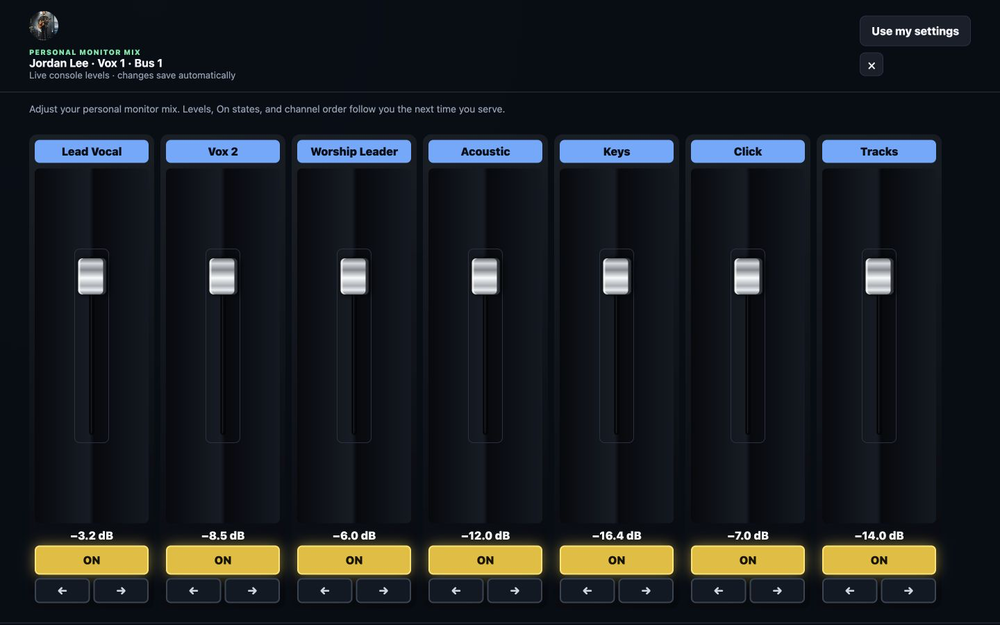

# Behringer X32 / WING mixer control

ChurchBoard can control and monitor Behringer X32, Midas M32, and Behringer WING-family consoles from a page-specific, touch-friendly fader bank.

## Connect the console

1. Connect ChurchBoard and the console to the same trusted production network. A wired connection is recommended.
2. In **Setup**, add **Behringer X32 / WING**, open its settings, and enable it.
3. Choose **X32 / M32** or **WING**, enter the console IP address, then use **Save & test console**.
4. Keep the normal OSC port unless the console was deliberately changed: UDP `10023` for X32/M32 or UDP `2223` for WING.

Do not expose a console's OSC port directly to the internet. ChurchBoard intentionally queries current values instead of claiming a long-lived console subscription, which makes it friendlier to other control software on the same production network.

## Build a fader bank

Add **Behringer faders** to any board and choose **Edit**. Add as many strips as the page needs. Each strip can control:

- an input channel;
- a channel send into a bus/aux mix;
- an X32 aux input;
- a bus/aux mix master;
- a DCA; or
- main LR/Mono.

The fader follows the X32's segmented travel from `−∞` through `−90 dB` to `+10 dB`, so the useful range around unity has the same generous physical spacing as the console. Mute state and fader position are read back from the mixer, including changes made at the desk.

## Configure Producer personal mixes

The same module can provide scheduled musicians with their own in-ear mix from the Producer workspace:

1. In the mixer module, map each Planning Center position to its console bus or aux mix.
2. Choose the input channels that should appear by default and arrange them in a sensible starting order.
3. In Producer, select **Adjust mix** on a scheduled person's position card.
4. Confirm that fader movements and per-source **On** states follow the physical console in both directions.

ChurchBoard saves each linked person's preferred levels, On states, and channel order locally. **Use my settings** recalls those choices the next time that person serves, even when they are assigned on a later service or date. Administrators and editors can open any scheduled person's mapped mix; volunteers are limited to their own linked Planning Center identity.

This workflow currently supports Behringer X32, Behringer WING-family, and Midas M32 consoles. Other console integrations are in development. Testers with safe access to other mixer families—and developers interested in contributing a module—are invited to use the [module development guide](MODULE_DEVELOPMENT.md) and report console model, firmware, and protocol results without including private network credentials.

## Credits and protocol notes

The OSC paths and X32 fader conversion were implemented with reference to Bitfocus Companion's open-source [Behringer X32 module](https://github.com/bitfocus/companion-module-behringer-x32) and [Behringer WING module](https://github.com/bitfocus/companion-module-behringer-wing), both published under the MIT License. Companion code is not bundled into ChurchBoard; ChurchBoard contains its own small OSC client. Behringer, X32, WING, and Midas are trademarks of their respective owners, and ChurchBoard is not affiliated with or endorsed by them.
