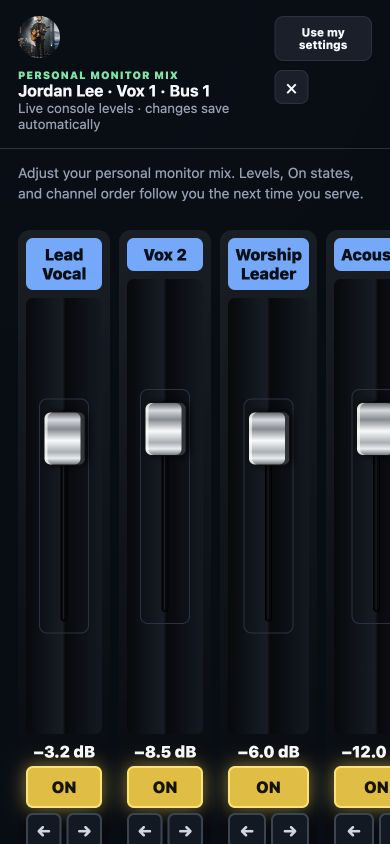

# Producer workspace

ChurchBoard extends the display system into a service-production workspace while retaining the existing local, no-login behavior until an owner account is created.

ChurchBoard selects the current Planning Center service time automatically, not only the service plan. This matters when a position has a different person at an early, middle, or late service. Administrators and editors can override the time from the Producer service-time menu; returning it to **Automatic for current time** resumes time-based selection.

The optional second listener defaults to port 80 and exposes only sign-in, the Producer workspace, checklists, locally mirrored resources, and their required APIs. It redirects attempts to open dashboards or Setup. Configure a different port such as 8080 when the operating system reserves port 80. Restart ChurchBoard after changing listener settings.

Planning Center tagged resources are downloaded by ChurchBoard during a successful tag refresh. Volunteers open the local copy and are not sent to a Planning Center login. When a later complete refresh confirms that a media item is no longer tagged, ChurchBoard removes its cached local copy. A failed or incomplete Planning Center refresh never triggers that cleanup.

## Start Producer

Open `/producer` on the ChurchBoard computer. On first use, ChurchBoard asks you to create the organization owner. Creating that account enables authentication for protected setup, editor, and producer pages.

Roles are intentionally simple:

- **Admin** manages users, campuses, integrations, layouts, checklist definitions, and resources.
- **Editor** manages layouts, checklist definitions, resources, and the live service workflow.
- **Volunteer** sees the work and resources for their own Planning Center person/positions and can complete assigned checklist tasks. The organization-wide Activity tab is shown only to admins and editors.

The owner chooses whether ChurchBoard accounts require passwords under **Producer → Team → Sign-in security**. With passwords off, the login page is a simple account chooser; this is convenient for a physically controlled production network but provides no protection against another person on that network. With passwords on, users sign in using email and password. ChurchBoard stores a salted PBKDF2 hash, not the original password. Sessions use HTTP-only cookies and become Secure when ChurchBoard is served over HTTPS.

If an administrator loses their credentials, open `/login` directly on the computer running ChurchBoard and choose **Lost administrator credentials?**. Enter the administrator email and a new password. Recovery is limited to loopback access and turns password sign-in back on.

## Campuses, users, and Planning Center positions

An admin can create, edit, or delete campuses and users from **Producer → Team**. A campus represents a physical church location and scopes its users, checklists, and resources. A single-location church can keep only **Main Campus** and otherwise ignore this feature. Deleting a campus moves its assigned users and producer content to the first remaining campus.

For volunteers, choose their name from the **Planning Center person** list or use **Match by name or email**. ChurchBoard stores Planning Center's internal link behind the scenes and then scopes the volunteer's work to that scheduled person. The raw person ID is no longer required in the interface.

The active service chooser at the top of Producer lists all plans currently returned by the configured Planning Center service types. Select a dated plan to lock ChurchBoard to it, or choose **Automatic service selection** to use the configured open/close timing window.

Admins and editors also have an **Audio history** tab. When ProdMesh RTA or Open Sound Meter reporting is enabled, ChurchBoard stores readings locally and groups them by Planning Center service time and active item. This keeps separate services separate even when they share the same plan. The tab shows a graph and minimum, average, and maximum for every song or item, with downloadable graph and CSV copies.

Checklist templates use the position keys returned by the configured Planning Center Services plan. A template can therefore follow whoever is scheduled as `Band · Vox 1`, `Production · Audio`, or another selected position instead of being tied permanently to one person.

## Personal in-ear monitor mixes

Producer can give a scheduled musician direct access to the console bus mapped to their Planning Center position. The position card shows **Adjust mix** when its position has a personal-monitor bus. Administrators and editors can open any scheduled person's mix; volunteers can open their own mapped mix.

The full-page mix provides large touch targets, horizontally scrollable channel strips, live level readback, and a yellow **On** state for each source in that mix. Changes made at the physical console are reflected in ChurchBoard, and changes made in ChurchBoard are sent back to the console. ChurchBoard automatically remembers the volunteer's levels, On states, and preferred channel order. On a later service, **Use my settings** reapplies their saved mix without replacing the default channel list chosen by the administrator.

Personal mixes currently support:

- Behringer X32 and X32-family consoles;
- Behringer WING, WING Compact, and WING Rack; and
- Midas M32 consoles.

Support for other console families is in development. Churches with other mixers can help by testing new modules on a safe production network or contributing a mixer module using the [module development guide](MODULE_DEVELOPMENT.md). Never expose a mixer's control port directly to the public internet.


The same mix becomes a swipeable phone interface; touching a fader adjusts it while swiping between strips reveals additional channels.



## Position checklists and resources

From **Producer → Checklists & resources**, name the checklist, choose its campus and Planning Center positions, add required or optional tasks, and save. Editing a template creates a new version so changes do not silently rewrite the definition used by earlier services. The Service tab combines the selected plan, scheduled people, matching templates, and per-service completion state. Activity records identify who changed each task and when.

Editors can also attach a link or upload a PDF, image, video, or document and associate it with positions and a campus. Uploaded files are kept beneath ChurchBoard's local data directory. Do not upload confidential material unless the host, backups, accounts, and network are secured appropriately.

ChurchBoard can also use your existing Planning Center Services Media library. In Planning Center, create a media tag group such as `Documentation`, add tags such as `Audio`, `Lights`, or `Producer`, and apply those tags to the appropriate media. In **Producer → Checklists & resources → Planning Center tagged media**, map each scheduled position to a media tag. A person scheduled for that position then sees every media item carrying that tag. Selecting it opens an authenticated viewer inside ChurchBoard rather than redirecting to Planning Center or forcing a download. One media item can be tagged for several roles without being uploaded again, and Planning Center remains the source of truth for the file and title.

The Personal Access Token user must be able to read Services Media and its tags. Prefer a dedicated ChurchBoard integration account with only the service-type and media permissions it needs. After changing tags in Planning Center, allow one runtime refresh or reopen the Producer workspace.

## Portable layouts and widget editing

Use **Export layouts** from the desktop control page to back up all dashboards, or export the open layout from its editor. **Import layout** validates the file before storing it; a conflicting slug or name is preserved by assigning the imported dashboard a new one. Treat exports as configuration files and review operational details before sharing them.

The editor palette groups widgets into Service & timing, Planning Center, ProPresenter, Audio & streaming, and Content. Search filters the list. Hover over the board controls and choose **Edit** to keep the current live board on screen while the editing palette slides in from the left. Click the always-visible **Edit** button in a widget's upper-right corner or right-click it to open settings in a modal. Drag a widget to move it, or drag its blue right edge, bottom edge, or corner to resize it. Saving closes the editor drawer and returns to the live board without opening another page.

Every displayed board has an **Edit** button beside the fullscreen and menu controls; on pointer-based computers these controls stay out of the way until that corner is hovered. The **Board navigation** widget adds touch-friendly links directly inside a layout. Its settings let you select only the destination boards that belong on that operator page, arrange them, and replace their displayed labels without renaming the boards themselves.

## HTTPS

Set the listening port and direct HTTPS certificate paths under **Setup → Web server**. A saved port or HTTPS change takes effect after ChurchBoard restarts. Environment variables remain available for managed installations and override the saved values:

```bash
export CHURCHBOARD_SSL_CERTFILE=/absolute/path/to/fullchain.pem
export CHURCHBOARD_SSL_KEYFILE=/absolute/path/to/private-key.pem
python run.py --background
```

ChurchBoard then listens at `https://<host>:8040`, or at the configured port. Port `80` is supported, although macOS and Linux normally require elevated privileges to bind ports below 1024; using a reverse proxy on ports 80/443 is usually safer. The certificate must include the hostname used by phones and tablets. A publicly trusted certificate avoids browser warnings; with an internal certificate authority, install that authority on every client. Never commit private keys. A maintained reverse proxy may terminate HTTPS instead. Authentication is not a substitute for firewalling: expose only the required port to the trusted production or staff network.

## Mobile use

On the same trusted network, open `https://churchboard-hostname:8040/producer` from a phone or tablet. Producer navigation, scheduled-person cards, checklists, forms, and editor chrome collapse to touch-friendly layouts. Live dashboards automatically stack widgets into a single readable column on narrow screens; the editor remains usable with touch-friendly settings and scrollable layout controls.

| Phone | Tablet |
| --- | --- |
|  |  |

## Current scope

ChurchBoard uses local accounts and local resource storage. Invitation email, password-reset email, SSO, directory synchronization, aggregate reporting, and cloud storage are not included. Back up the ChurchBoard data directory and export layouts regularly.
